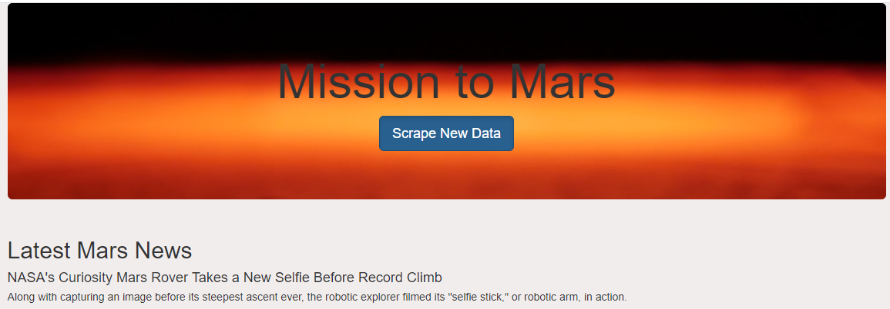
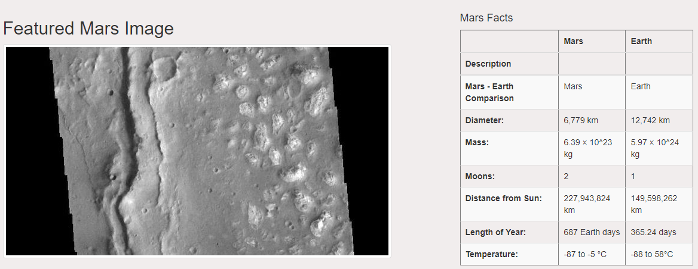
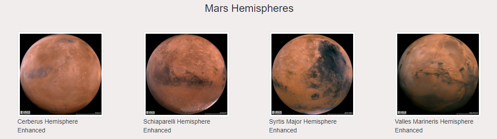

# Mission-to-Mars
**Purpose:**  To write a Python script that would gather information about the mission to Mars and display it in a web app 

## Overview
BeautifulSoup and Splinter will be used to scrape full-resolution images of Mars’s hemispheres and the titles of those images. The data will be stored on a Mongo database and displayed using a web application. 

The three technical deliverables for this project include,

1. Scrape Full-Resolution Mars Hemisphere Images and Titles
2. Update the Web App with Mars Hemisphere Images and Titles
3. Add Bootstrap 3 Components

## Resources
- Software: Software: Python 3.7.6 :: Anaconda, Inc., conda 4.10.1, Jupyter Notebook, Visual Studio Code, 1.56, Splinter, BeautifulSoup, and MongoDB 4.4.

## Results

**Latest Mars News**  

    

**Featured Mars Image and Facts**  

    

**Mars Hemispheres**  

    

